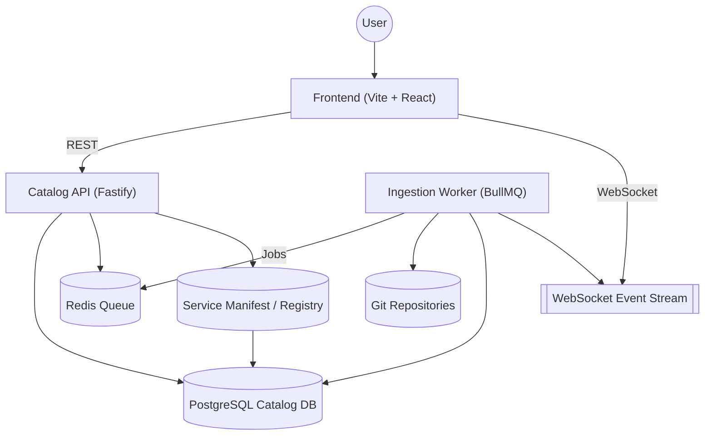

# Platform Architecture

## Vision
Build a "YouTube of web applications" where each application is sourced from a Git repository. Every repository contains a `Dockerfile`, allowing the platform to build, catalogue, and sandbox-run the app and surface metadata for discovery via a tag-driven search UI with keyboard-friendly autocomplete.

## Core Components
- **Ingestion Service**: Validates repository metadata, clones repos, inspects `Dockerfile`, and triggers container image builds. The prototype uses a BullMQ (Redis-backed) worker that consumes ingestion jobs, verifies the declared Dockerfile (or discovers one), enriches tags from repo artifacts, and records commit SHA + elapsed time for each attempt.
- **Registry & Metadata Store**: Persists repositories, tag associations, build status, runtime configuration, and user curation data. The catalog now runs on PostgreSQL (via the `pg` connection pool) for concurrency and cloud deployments.
- **Runner Service**: Schedules containerized apps, exposes preview URLs, handles lifecycle (start/stop) with resource quotas.
- **Search & Recommendation API**: Indexes metadata, supports tag-based search (`key:value` pairs), and powers autocomplete suggestions.
- **Frontend Web App**: Provides a search-first experience with keyboard-centric autocomplete, surfaces app cards, and allows launching previews.
- **Background Workers**: Handle ingestion and build pipelines, periodic repo sync (polling webhooks), tag enrichment, and stale build cleanup. The ingestion worker hydrates metadata before handing off to a dedicated build worker that can run inline (dev) or via BullMQ (prod).
- **Service Registry**: Maintains a catalogue of auxiliary services (kind, base URL, health, capabilities) in PostgreSQL. Services can be registered declaratively via manifest or at runtime through authenticated API calls, and health polling keeps status changes flowing to subscribers.
- **Real-Time Event Stream**: A lightweight event bus in the catalog service emits repository, build, launch, and ingestion timeline changes. Fastify exposes these events over a WebSocket endpoint so the frontend can react without polling.

## System Overview

## Data Model (Initial Draft)
- `Repository`
  - `id`, `name`, `git_url`, `default_branch`
  - `description`, `homepage`, `owner` (user/organization)
  - `ingest_status`, `last_ingested_at`, `ingest_error`, `ingest_attempts`
- `Build`
  - `id`, `repository_id`, `commit_sha`
  - `status`, `logs`, `image_tag`, `error_message`
  - `started_at`, `completed_at`, `duration_ms`
- `Tag`
  - `id`, `key`, `value`
  - `description`
- `RepositoryTag`
  - `repository_id`, `tag_id`, `source` (author/manual/auto)
- `IngestionEvent`
  - `repository_id`, `status`, `message`, `attempt`, `commit_sha`, `duration_ms`, `created_at`
- `Launch`
  - `id`, `repository_id`, `build_id`, `instance_url`
  - `status`, `created_at`, `expires_at`, `resource_profile`

## Key Workflows
1. **Repository Registration**
   - User submits repo URL + optional metadata/tags.
   - Ingestion Service clones the repo, verifies `Dockerfile`, extracts metadata (`package.json`, `README`, `tags.yaml`), and enqueues a build.
   - Metadata & initial tags stored in the Registry.

2. **Ingestion & Image Build Pipeline**
   - API enqueues ingestion jobs in BullMQ whenever a repository is registered or refreshed.
   - Ingestion worker consumes jobs, performs shallow clone, validates `Dockerfile` presence, and extracts metadata (`package.json`, `README`, `tags.yaml`, Dockerfile heuristics).
   - Successful ingestion refreshes tags/runtime hints, marks the repo `ready`, and creates a build record that is enqueued for the build worker; failures capture the error message for operator review and allow queued retries.
   - Every transition (queued, processing, failed, ready) is written to `ingestion_events` for timeline auditing and streamed to clients over the WebSocket channel.
   - Build worker clones the repo afresh, executes `docker build` via the local Docker daemon, records logs inline in PostgreSQL, stores the resulting image tag for launch orchestration, and emits build status updates to the event stream.

3. **Search & Autocomplete**
   - Search API indexes repositories & tags.
   - Autocomplete returns top tag keys and `key:value` pairs matching current prefix.
   - Search queries filter repositories by tags (AND semantics by default).

4. **App Launch**
   - User selects an app, requests launch.
   - Runner schedules container, wires frontend proxy route, returns preview URL.
   - Optional warm pool for popular apps.

5. **Service Discovery & Health Tracking**
   - Operators sync JSON manifests describing external services through registry import endpoints; the catalog does not auto-ingest manifests at startup.
   - A background poller probes each service's health endpoint, updates status/metadata in PostgreSQL, and publishes `service.updated` events over Redis/WebSocket so consumers can react immediately.
   - Operators or services themselves can register/patch definitions at runtime using `POST /services` and `PATCH /services/:slug` with a shared token, enabling dynamic onboarding without code changes.

## Tech Stack Proposal (MVP)
- **Backend / API**: TypeScript + Fastify or NestJS, backed by PostgreSQL for metadata, Redis for job queues.
- **Workers**: Node.js or Python workers orchestrated via BullMQ / Celery. Prototype worker already uses BullMQ + Redis with `simple-git` for repo cloning.
- **Container Builds**: BuildKit via Docker or remote builder; images stored in an internal registry (e.g., registry:2 or GHCR).
- **Search**: Postgres full-text with GIN for MVP; upgrade to OpenSearch/Meilisearch when necessary.
- **Frontend**: Next.js (React) with Tailwind for rapid UI dev; uses backend GraphQL/REST for data.
- **Infrastructure**: Kubernetes or Nomad for runners; object storage (S3/GCS) for build logs.

## MVP Scope
- Manual repo registration with webhook-based update (optional).
- PostgreSQL-backed metadata store with versioned migrations.
- BullMQ-driven ingestion worker that hydrates metadata/tag landscape before builds are available.
- Search API limited to metadata + tags.
- Frontend renders searchable list with app cards, displays status, links to preview (stub).
- Autocomplete driven by stored tag vocabulary with key/pair suggestions.
- WebSocket-connected frontend reacts to event stream updates for repository, build, and launch status without manual refresh.

## Future Enhancements
- User accounts, favorites, comments.
- Usage analytics-based ranking.
- Automated tag extraction (language detection, framework detection).
- Workspace snapshots & persistent storage for stateful apps.
- Billing/quotas for heavy usage.

## Workflow Operations UI
- Dedicated Workflows page renders the catalog of workflow definitions with status, repository, service, and tag filters backed by live metadata.
- Operators can explore definitions, inspect DAG visualizations, and monitor run history in real time via the existing WebSocket event stream.
- Manual run initiation now uses JSON Schema–driven forms or raw JSON editing with client-side validation (AJV) before enqueuing runs.
- Run details surface per-step metrics, log links, and error messages, keeping context for troubleshooting without leaving the UI.
- Components were structured for reuse (`WorkflowGraph`, `ManualRunPanel`, `WorkflowFilters`) so future operator surfaces can embed the same building blocks.

## Workflow DAG Scheduling
- Workflow definitions are validated as directed acyclic graphs. Missing dependencies or cycles are rejected at definition time with actionable error metadata (`reason`, dependency id, or detected cycle path).
- The orchestrator materializes adjacency metadata when definitions are stored. Each step now records its `dependents`, and a normalized `dag` payload (roots, adjacency list, topological order, edge count) is persisted alongside the definition.
- At runtime the scheduler evaluates the DAG to launch every ready step in parallel up to a configurable cap. Per-run concurrency defaults to `WORKFLOW_CONCURRENCY`/`WORKFLOW_MAX_PARALLEL`, and can be overridden via definition metadata (`metadata.scheduler.maxParallel`) or run parameters (`workflowConcurrency`).
- Step handlers update only their slice of the workflow context using JSON patches. This prevents concurrent branches from clobbering `workflow_runs.context` and keeps shared values in sync even when fan-out/fan-in patterns execute.
- Fan-out (one step to many dependents) and fan-in (multiple dependencies converging) scenarios are first-class: readiness is recalculated after every step completion, and the runtime metrics track total and completed steps across all branches.

## Security & Access Controls
- Operator and service automations authenticate with scoped bearer tokens supplied via `APPHUB_OPERATOR_TOKENS` or `APPHUB_OPERATOR_TOKENS_PATH`. Scopes (`jobs:write`, `jobs:run`, `workflows:write`, `workflows:run`) gate job/workflow definition changes and manual executions.
- All sensitive actions, including failed authorization attempts, are written to the `audit_logs` table with actor identity, IP/user-agent, and contextual metadata for post-incident forensics.
- Job handlers gain a `resolveSecret` helper that records audit entries whenever runtime secrets are fetched.

## Secret Management
- Workflow service steps and job handlers resolve runtime credentials through a pluggable secret store (inline JSON or file-backed) rather than raw environment access.
- Secrets support optional version hints; mismatches and missing keys are surfaced as orchestration errors and captured in audit logs.
- Secret access metadata (workflow run, step ID, job run) is persisted, enabling compliance reviews and least-privilege validation.

## Observability Enhancements
- All worker and orchestration logs emit structured JSON and (optionally) forward to an external log aggregation service via `APPHUB_LOG_AGGREGATOR_URL`.
- The catalog API exposes `GET /metrics`, publishing aggregate job/workflow run counts, average duration, and failure rates for dashboards and alerting baselines.
- Repeated workflow failures trigger structured warnings and optional webhooks once `WORKFLOW_FAILURE_ALERT_THRESHOLD` is exceeded within the sliding window defined by `WORKFLOW_FAILURE_ALERT_WINDOW_MINUTES`.
- Alert payloads include workflow definition IDs, run IDs, failure counts, and triggers so incident responders can pivot quickly.

## Deployment & Rollout Readiness
- See `docs/workflow-rollout.md` for the staged rollout plan, rollback procedures, and environment-to-environment workflow migration guidance.
