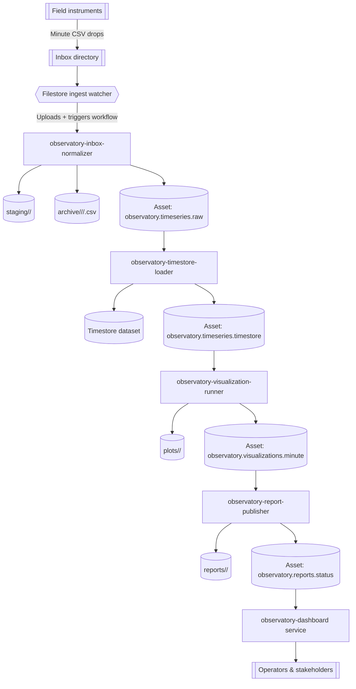

# Environmental Observatory Instrument Network

The environmental observatory scenario models a network of field instruments that stream minute-by-minute CSV measurements into an inbox directory. A set of AppHub workflows ingest the raw readings, persist them into Timestore, render updated plots, publish refreshed status pages, and optionally register report metadata in the Metastore whenever upstream assets change. The example leans on workflow asset lineage plus auto-materialization so downstream documents stay current without manual intervention.

The event-driven flavour now partitions Timestore manifests per instrument and propagates the instrument id through trigger parameters, enabling publication workflows to run for each sensor independently while sharing the same DAG.

> **Event-driven variant**
>
> In addition to the original file-watcher walkthrough, the repository now ships an event-driven flavour under `examples/environmental-observatory-event-driven/`. CSV uploads flow through Filestore, the inbox normalizer emits `observatory.minute.raw-uploaded`, downstream publication reacts to `observatory.minute.partition-ready`, and a dashboard aggregation workflow publishes `observatory.dashboard.updated` after querying Timestore for fleet-wide stats. See the [README](../examples/environmental-observatory-event-driven/README.md) for setup instructions (`materializeConfig.ts`, `setupTriggers.ts`, and the upgraded services).

## Event-driven benchmark status (2025-09-29)

- The `environmentalObservatoryEventDrivenBenchmark.e2e.ts` harness now provisions dedicated Dockerized MinIO and Redis instances, packages example bundles inline, and wires cleanup on `SIGINT/SIGTERM` so the scenario runs from a single command.
- Embedded Postgres plus catalog/filestore/metastore/timestore test servers start successfully and the data generator uploads 10 instrument CSVs to MinIO with matching metastore records.
- Inbox normalizer emits `observatory.minute.raw-uploaded` events into the catalog queue, trigger deliveries are created, but the `observatory-minute-ingest` workflow never launches; the benchmark currently fails waiting for that run.
- Suspect area: catalog event trigger processing when queues run against the external Redis container. The next session should inspect the event ingress queue and trigger delivery retries to confirm whether events are enqueued but not drained, or if a rendering error drops the job before launch.
- To resume quickly: rerun `npx tsx examples/tests/catalog/environmentalObservatoryEventDrivenBenchmark.e2e.ts` (set `OBSERVATORY_BENCH_INSTRUMENTS=10`) and tail catalog logs for trigger processing around the first minute (look for `Trigger delivery not found for retry`).


## Architecture overview



## Data drop and directory layout

Each instrument pushes a minute CSV into an inbox (`examples/environmental-observatory-event-driven/data/inbox`). Filenames follow `instrument_<ID>_<YYYYMMDDHHmm>.csv` and include per-reading metadata. The normalizer workflow copies matching files into minute-stamped folders under `staging/` before handing them to the Timestore ingestion job:

```
examples/environmental-observatory-event-driven/data/
  inbox/
    instrument_alpha_202508010900.csv
    instrument_alpha_202508011000.csv
    instrument_bravo_202508010900.csv
  staging/
  plots/
  reports/
```

CSV columns:

| column | description |
| ------ | ----------- |
| `timestamp` | ISO-8601 timestamp for the sample (minute resolution). |
| `instrument_id` | Stable identifier for the sensor. |
| `site` | Site code (e.g. `west-basin`). |
| `temperature_c` | Ambient temperature in Celsius. |
| `relative_humidity_pct` | Relative humidity in percent. |
| `pm2_5_ug_m3` | Particulate matter (µg/m³). |
| `battery_voltage` | Sensor battery voltage. |

## Calibration inputs (event-driven variant)

- `scripts/materializeConfig.ts` now records `filestore.calibrationsPrefix` (default `datasets/observatory/calibrations`) and `filestore.plansPrefix` (`datasets/observatory/calibrations/plans`) in the generated configuration.
- The materializer pre-creates both prefixes in Filestore so operators can upload calibration JSON/CSV files and future reprocessing plans without manual setup.
- Workflows, triggers, and services read these prefixes from `.generated/observatory-config.json`; upcoming calibration tooling will rely on them to locate operator uploads and generated plan artifacts.

## Jobs

Four Node jobs orchestrate the pipeline. Bundle them with `npx tsx apps/cli/src/index.ts jobs package <bundle>` before registering definitions.

| Bundle | Slug | Purpose |
| ------ | ---- | ------- |
| `examples/environmental-observatory-event-driven/jobs/observatory-inbox-normalizer` | `observatory-inbox-normalizer` | Moves new CSV files from `inbox` to `staging`, archives the originals under instrument/hour folders, extracts metadata, and emits the partitioned raw asset. |
| `examples/environmental-observatory-event-driven/jobs/observatory-timestore-loader` | `observatory-timestore-loader` | Streams normalized readings into Timestore, producing per-instrument minute partitions and tagging each manifest entry with instrument metadata. |
| `examples/environmental-observatory-event-driven/jobs/observatory-visualization-runner` | `observatory-visualization-runner` | Queries Timestore for fresh aggregates, saves plot SVGs into `plots`, and emits a visualization asset cataloguing the artifacts. |
| `examples/environmental-observatory-event-driven/jobs/observatory-report-publisher` | `observatory-report-publisher` | Renders Markdown and HTML reports plus JSON API payloads in `reports`, consuming the visualization asset and republishing web-ready content.

Each bundle ships with an `apphub.bundle.json` and Node entry point so you can register them via the catalog API once built.

## Assets and lineage

| Asset id | Producer | Consumers | Notes |
| -------- | -------- | --------- | ----- |
| `observatory.timeseries.raw` | Inbox normalizer workflow step | Timestore loader | `timeWindow` partitioned by minute (format `YYYY-MM-DDTHH:mm`). Produced when new CSVs land in the inbox. Includes Filestore `files` metadata (paths, node ids, checksums), staging prefixes, and per-file calibration references plus a `calibrationsApplied` summary sourced from the Metastore. |
| `observatory.timeseries.timestore` | Timestore loader workflow step | Visualization runner | References the curated Timestore manifest, including ingestion mode, manifest id, row counts, and the calibration id/effectiveAt/version applied during ingestion. Declares `freshness.ttlMs = 60_000` to expire after one minute if no new data arrives. |
| `observatory.visualizations.minute` | Visualization runner workflow step | Report publisher | Lists generated plots (`temperature_trend.svg`, `air_quality_small_multiples.png`) and summary metrics. `autoMaterialize.onUpstreamUpdate = true` so new Timestore partitions retrigger plotting automatically. |
| `observatory.reports.status` | Report publisher workflow step | Frontend/web CDN | Bundles Markdown, HTML, and JSON payloads for the site. Produces audit-friendly provenance (`generatedAt`, `plotArtifacts`) and is also a candidate for downstream notifications. |
| `observatory.calibration.instrument` | Calibration import workflow step | Future ingest/planning flows | Stores the canonical calibration payload (instrument, effectiveAt, offsets/scales, metadata) plus metastore linkage for reprocessing planners. |

The lineage graph forms a linear chain: inbox → Timestore → plots → reports. Auto-materialization guarantees the visualization workflow runs after each upstream Timestore ingest, which in turn triggers the reporting step. The asset history for `observatory.reports.status` makes it easy to diff report revisions over time.

## Workflows

Two workflows manage the example. Their JSON definitions live in `examples/environmental-observatory-event-driven/workflows/`.

- **Trigger:** Manual or filesystem watcher (optional) when the minute inbox directory receives new CSVs.
- **Steps:**
  1. `observatory-inbox-normalizer` (job) produces `observatory.timeseries.raw` partitioned by minute. As part of normalization it resolves the latest Metastore calibration for each instrument, logs gaps/future-effective versions, and records the reference in both the per-file metadata and the `calibrationsApplied` summary. Declares `autoMaterialize.onUpstreamUpdate = true` so fresh raw data kicks off Timestore ingestion.
  2. `observatory-timestore-loader` consumes the raw asset, fetches the referenced calibration snapshot (or the active calibration when ingest is re-run), applies offsets/scales to each reading before streaming into Timestore, and produces `observatory.timeseries.timestore` with `freshness.ttlMs` tuned for minute cadence plus calibration lineage in the manifest summary.
- **Parameters:** `minute`, Filestore connection details (`filestoreBaseUrl`, `filestoreBackendId`, `inboxPrefix`, `stagingPrefix`, `archivePrefix`), optional `maxFiles`, and the Timestore dataset coordinates.
- **Defaults:** Derived from the generated observatory config; ingestion works entirely through Filestore prefixes.

### 2. `observatory-daily-publication`

- **Trigger:** Auto-materialization on `observatory.visualizations.minute` plus an optional 24-hour cadence for end-of-day summaries.
- **Steps:**
  1. `observatory-visualization-runner` reads `observatory.timeseries.timestore`, uploads plots into the visualization prefix, and produces `observatory.visualizations.minute` with Filestore artifact metadata.
  2. `observatory-report-publisher` consumes the visualization asset and produces `observatory.reports.status`, uploading Markdown (`status.md`), HTML (`status.html`), and JSON (`status.json`) artifacts to the reports prefix.
- **Parameters:** `timestoreBaseUrl`, `timestoreDatasetSlug`, Filestore settings (`filestoreBaseUrl`, `filestoreBackendId`, `visualizationsPrefix`, `reportsPrefix`), optional `siteFilter`, `reportTemplate`, and optional Metastore settings (`metastoreBaseUrl`, `metastoreNamespace`).

### 3. `observatory-calibration-import`

- **Trigger:** `filestore.command.completed` scoped to the calibration prefix.
- **Steps:** Single step that runs `observatory-calibration-importer`, downloading the uploaded calibration JSON, validating offsets/gains, and upserting the canonical record into the Metastore.
- **Outputs:** Emits the `observatory.calibration.instrument` asset and an `observatory.calibration.updated` event so orchestrators can plan reprocessing.
- **Parameters:** Filestore connection (`filestoreBaseUrl`, `filestoreBackendId`, optional `filestoreToken`/`principal`), the uploaded file path/node id, and Metastore coordinates (`metastoreBaseUrl`, `metastoreNamespace`, optional token).

## Auto-materialization flow

1. Inbox workflow runs after new CSV drops. Step 1 copies files into the staging Filestore prefix, moves the originals under the archive prefix, records row counts, and produces `observatory.timeseries.raw` (minute partition). The asset materializer notices the new partition.
2. Because the ingest step declares `autoMaterialize.onUpstreamUpdate`, the workflow enqueues the Timestore loader immediately for the same partition. The loader produces `observatory.timeseries.timestore` and schedules an expiry after 60 minutes.
3. The visualization workflow listens to `observatory.timeseries.timestore`. When a snapshot is produced or expires, the materializer runs `observatory-visualization-runner`, regenerating SVG plots straight to Filestore.
4. The reporting step consumes the visualization asset. Since it also opts into `autoMaterialize.onUpstreamUpdate`, any new plots automatically yield fresh reports (Markdown/HTML/JSON) in Filestore.
5. Reports are now available for the frontend or external publishing, and when Metastore credentials are supplied the latest payload metadata is upserted into `observatory.reports` for search and auditing. The dashboard service streams the latest report files directly from Filestore, so operators always see fresh metrics without relying on repository directories. Asset history exposes run keys, run IDs, and payload diffs for auditing.
6. When calibration uploads arrive the calibration workflow publishes `observatory.calibration.instrument`, which downstream reprocessing planners can use to decide which partitions to rebuild before re-triggering ingest.

## Running the demo locally

1. Install dependencies for the watcher, visualization, and publisher bundles:
```bash
npm install --prefix examples/environmental-observatory-event-driven/jobs/observatory-timestore-loader
npm install --prefix examples/environmental-observatory-event-driven/jobs/observatory-visualization-runner
npm install --prefix examples/environmental-observatory-event-driven/jobs/observatory-report-publisher
```

   The catalog rebuilds each observatory bundle automatically when you import the example jobs. Every `/job-imports` request now copies the bundle into an isolated workspace, runs `npm ci`, executes the build, and force-publishes the tarball so the catalog overwrites any previous artifact. Pre-installing dependencies locally keeps the first rebuild snappy; otherwise the API performs the install step inside the container on every import.
2. Publish bundles and register the job definitions exported from the example module.
3. Import the bundled service manifest (`examples/environmental-observatory-event-driven/service-manifests/service-manifest.json`) through the catalog UI or copy it into your manifest directory so the watcher and dashboard show up as managed services. When importing through the UI the catalog now prompts for the inbox, staging, archive, and Timestore settings (base URL + dataset) plus the reports directory, all pre-filled with the defaults above, and requires an operator API token before applying the manifest. Adjust the directories if you keep the data elsewhere and paste a token with permission to trigger workflows.

4. Launch the filestore ingest watcher so new inbox files land in MinIO and trigger `observatory-minute-ingest` automatically (configured via the observatory service manifest described above):
   ```bash
   npm run dev:minio

   cd services/filestore-ingest-watcher
   npm install

   WATCH_ROOT=$(pwd)/../examples/environmental-observatory-event-driven/data/inbox \
   WATCH_ARCHIVE_DIR=$(pwd)/../examples/environmental-observatory-event-driven/data/archive \
   FILESTORE_BASE_URL=http://127.0.0.1:4300 \
   FILESTORE_BACKEND_ID=1 \
   FILESTORE_TARGET_PREFIX=datasets/observatory/inbox \
   npm run dev
   ```
   The watcher streams new inbox files into the `apphub-filestore` bucket (via Filestore) before launching the ingest workflow. Adjust `FILESTORE_BACKEND_ID` if you provisioned a different mount via `npm run obs:event:config`.
5. Launch the dashboard alongside the watcher so the latest `status.html` is always visible:
   ```bash
   cd examples/environmental-observatory-event-driven/services/observatory-dashboard
   npm install

   REPORTS_DIR=$(pwd)/../../data/reports \
   PORT=4311 \
   npm run dev
   ```
6. Register both workflows by copying the curated JSON definitions:
   ```bash
   cp examples/environmental-observatory-event-driven/workflows/observatory-minute-ingest.json tmp/observatory-minute-ingest.json
   cp examples/environmental-observatory-event-driven/workflows/observatory-daily-publication.json tmp/observatory-daily-publication.json
   ```
7. Simulate an instrument drop by writing new minute CSV files into `inbox` (the watcher will mirror them into `staging/<minute>/` and queue the ingest workflow automatically). Trigger the ingest workflow manually with:
   ```bash
   curl -X POST http://127.0.0.1:4000/workflows/observatory-minute-ingest/run \
     -H "Authorization: Bearer $TOKEN" \
     -H "Content-Type: application/json" \
     --data '{
       "partitionKey": "2025-08-01T09:00",
       "parameters": {
         "minute": "2025-08-01T09:00",
         "inboxDir": "examples/environmental-observatory-event-driven/data/inbox",
         "stagingDir": "examples/environmental-observatory-event-driven/data/staging",
         "archiveDir": "examples/environmental-observatory-event-driven/data/archive",
        "timestoreBaseUrl": "http://127.0.0.1:4200",
        "timestoreDatasetSlug": "observatory-timeseries",
        "timestoreDatasetName": "Observatory Time Series",
        "timestoreTableName": "observations"
       }
     }'
   ```
8. Inspect assets via the API:
   ```bash
   curl -sS http://127.0.0.1:4000/workflows/observatory-minute-ingest/assets | jq
   curl -sS http://127.0.0.1:4000/workflows/observatory-daily-publication/assets | jq
   ```

9. After the visualization workflow emits `observatory.visualizations.minute`, either trigger `observatory-daily-publication` manually once (to provide initial parameters) or let auto-materialization run it. Inspect the rendered files under `examples/environmental-observatory-event-driven/data/reports/<minute>/` to view the Markdown, HTML, and JSON outputs side by side.

This example demonstrates how AppHub’s asset graph keeps downstream pages synchronized with instrument feeds. By pairing partitioned assets, Timestore manifests, SVG plots, and auto-materialized reports, operators get traceable lineage and consistently fresh observatory dashboards.
