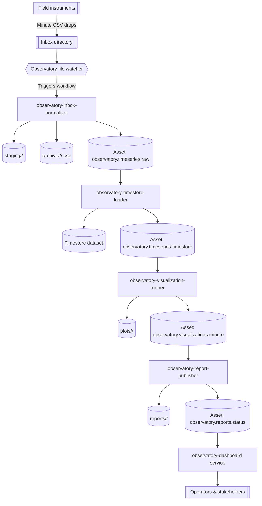

# Environmental Observatory Instrument Network

The environmental observatory scenario models a network of field instruments that stream minute-by-minute CSV measurements into an inbox directory. A set of AppHub workflows ingest the raw readings, persist them into Timestore, render updated plots, publish refreshed status pages, and optionally register report metadata in the Metastore whenever upstream assets change. The example leans on workflow asset lineage plus auto-materialization so downstream documents stay current without manual intervention.

> **Event-driven variant**
>
> In addition to the original file-watcher walkthrough, the repository now ships an event-driven flavour under `examples/environmental-observatory-event-driven/`. CSV uploads flow through Filestore, workflow triggers react to `filestore.command.completed` and `timestore.partition.created` events, and a shared config file keeps jobs, services, and triggers in sync. See the [README](../examples/environmental-observatory-event-driven/README.md) for setup instructions (`materializeConfig.ts`, `setupTriggers.ts`, and the new services).

## Architecture overview



## Data drop and directory layout

Each instrument pushes a minute CSV into an inbox (`examples/environmental-observatory/data/inbox`). Filenames follow `instrument_<ID>_<YYYYMMDDHHmm>.csv` and include per-reading metadata. The normalizer workflow copies matching files into minute-stamped folders under `staging/` before handing them to the Timestore ingestion job:

```
examples/environmental-observatory/data/
  inbox/
    instrument_alpha_202508010900.csv
    instrument_alpha_202508011000.csv
    instrument_bravo_202508010900.csv
  staging/
  plots/
  reports/
```

CSV columns:

| column | description |
| ------ | ----------- |
| `timestamp` | ISO-8601 timestamp for the sample (minute resolution). |
| `instrument_id` | Stable identifier for the sensor. |
| `site` | Site code (e.g. `west-basin`). |
| `temperature_c` | Ambient temperature in Celsius. |
| `relative_humidity_pct` | Relative humidity in percent. |
| `pm2_5_ug_m3` | Particulate matter (µg/m³). |
| `battery_voltage` | Sensor battery voltage. |

## Jobs

Four Node jobs orchestrate the pipeline. Bundle them with `npx tsx apps/cli/src/index.ts jobs package <bundle>` before registering definitions.

| Bundle | Slug | Purpose |
| ------ | ---- | ------- |
| `examples/environmental-observatory/jobs/observatory-inbox-normalizer` | `observatory-inbox-normalizer` | Moves new CSV files from `inbox` to `staging`, archives the originals under instrument/hour folders, extracts metadata, and emits the partitioned raw asset. |
| `examples/environmental-observatory/jobs/observatory-timestore-loader` | `observatory-timestore-loader` | Streams normalized readings into Timestore, producing a dataset-backed asset with per-minute partitions. |
| `examples/environmental-observatory/jobs/observatory-visualization-runner` | `observatory-visualization-runner` | Queries Timestore for fresh aggregates, saves plot SVGs into `plots`, and emits a visualization asset cataloguing the artifacts. |
| `examples/environmental-observatory/jobs/observatory-report-publisher` | `observatory-report-publisher` | Renders Markdown and HTML reports plus JSON API payloads in `reports`, consuming the visualization asset and republishing web-ready content.

Each bundle ships with an `apphub.bundle.json` and Node entry point so you can register them via the catalog API once built.

## Assets and lineage

| Asset id | Producer | Consumers | Notes |
| -------- | -------- | --------- | ----- |
| `observatory.timeseries.raw` | Inbox normalizer workflow step | Timestore loader | `timeWindow` partitioned by minute (format `YYYY-MM-DDTHH:mm`). Produced when new CSVs land in the inbox. Includes `sourceFiles`, row counts, and staging directory metadata. |
| `observatory.timeseries.timestore` | Timestore loader workflow step | Visualization runner | References the curated Timestore manifest, including ingestion mode, manifest id, and row counts. Declares `freshness.ttlMs = 60_000` to expire after one minute if no new data arrives. |
| `observatory.visualizations.minute` | Visualization runner workflow step | Report publisher | Lists generated plots (`temperature_trend.svg`, `air_quality_small_multiples.png`) and summary metrics. `autoMaterialize.onUpstreamUpdate = true` so new Timestore partitions retrigger plotting automatically. |
| `observatory.reports.status` | Report publisher workflow step | Frontend/web CDN | Bundles Markdown, HTML, and JSON payloads for the site. Produces audit-friendly provenance (`generatedAt`, `plotArtifacts`) and is also a candidate for downstream notifications.

The lineage graph forms a linear chain: inbox → Timestore → plots → reports. Auto-materialization guarantees the visualization workflow runs after each upstream Timestore ingest, which in turn triggers the reporting step. The asset history for `observatory.reports.status` makes it easy to diff report revisions over time.

## Workflows

Two workflows manage the example. Their JSON definitions live in `examples/environmental-observatory/workflows/`.

- **Trigger:** Manual or filesystem watcher (optional) when the minute inbox directory receives new CSVs.
- **Steps:**
  1. `observatory-inbox-normalizer` (job) produces `observatory.timeseries.raw` partitioned by minute. Declares `autoMaterialize.onUpstreamUpdate = true` so fresh raw data kicks off Timestore ingestion.
  2. `observatory-timestore-loader` consumes the raw asset, streams data into Timestore, and produces `observatory.timeseries.timestore` with `freshness.ttlMs` tuned for minute cadence.
- **Parameters:** `inboxDir`, `stagingDir`, `archiveDir`, `minute`, `timestoreBaseUrl`, `timestoreDatasetSlug`, and optional limits like `maxFiles`.
- **Default directories:** Match the example layout under `examples/environmental-observatory/data/`.

### 2. `observatory-daily-publication`

- **Trigger:** Auto-materialization on `observatory.visualizations.minute` plus an optional 24-hour cadence for end-of-day summaries.
- **Steps:**
  1. `observatory-visualization-runner` reads `observatory.timeseries.timestore`, writes plots into `plots/`, and produces `observatory.visualizations.minute` with artifact metadata.
  2. `observatory-report-publisher` consumes the visualization asset and produces `observatory.reports.status` along with Markdown (`status.md`), HTML (`status.html`), and JSON (`status.json`) outputs in `reports/`.
- **Parameters:** `timestoreBaseUrl`, `timestoreDatasetSlug`, `plotsDir`, `reportsDir`, optional `siteFilter`, `reportTemplate`, and optional Metastore settings (`metastoreBaseUrl`, `metastoreNamespace`).

## Auto-materialization flow

1. Inbox workflow runs after new CSV drops. Step 1 copies files into `staging/<minute>/`, moves the originals into `archive/<instrument>/<hour>/<minute>.csv`, records row counts, and produces `observatory.timeseries.raw` (minute partition). The asset materializer notices the new partition.
2. Because the ingest step declares `autoMaterialize.onUpstreamUpdate`, the workflow enqueues the Timestore loader immediately for the same partition. The loader produces `observatory.timeseries.timestore` and schedules an expiry after 60 minutes.
3. The visualization workflow listens to `observatory.timeseries.timestore`. When a snapshot is produced or expires, the materializer runs `observatory-visualization-runner`, regenerating plots.
4. The reporting step consumes the visualization asset. Since it also opts into `autoMaterialize.onUpstreamUpdate`, any new plots automatically yield fresh reports.
5. Reports are now available for the frontend or external publishing, and when Metastore credentials are supplied the latest payload metadata is upserted into `observatory.reports` for search and auditing. The dashboard service polls the latest `status.json` file so operators always see fresh metrics without refreshing manually. Asset history exposes run IDs and payload diffs for auditing.

## Running the demo locally

1. Install dependencies for the watcher, visualization, and publisher bundles:
```bash
npm install --prefix examples/environmental-observatory/jobs/observatory-timestore-loader
npm install --prefix examples/environmental-observatory/jobs/observatory-visualization-runner
npm install --prefix examples/environmental-observatory/jobs/observatory-report-publisher
```

   The catalog rebuilds each observatory bundle automatically when you import the example jobs. Every `/job-imports` request now copies the bundle into an isolated workspace, runs `npm ci`, executes the build, and force-publishes the tarball so the catalog overwrites any previous artifact. Pre-installing dependencies locally keeps the first rebuild snappy; otherwise the API performs the install step inside the container on every import.
2. Publish bundles and register the job definitions exported from the example module.
3. Import the bundled service manifest (`examples/environmental-observatory/service-manifests/service-manifest.json`) through the catalog UI or copy it into your manifest directory so the watcher and dashboard show up as managed services. When importing through the UI the catalog now prompts for the inbox, staging, archive, and Timestore settings (base URL + dataset) plus the reports directory, all pre-filled with the defaults above, and requires an operator API token before applying the manifest. Adjust the directories if you keep the data elsewhere and paste a token with permission to trigger workflows.

4. Launch the observatory watcher so new inbox files trigger `observatory-minute-ingest` automatically (see `docs/file-drop-watcher.md` for details):
   ```bash
   cd examples/environmental-observatory/services/observatory-file-watcher
   npm install

   FILE_WATCH_ROOT=$(pwd)/../../data/inbox \
   FILE_WATCH_STAGING_DIR=$(pwd)/../../data/staging \
   FILE_ARCHIVE_DIR=$(pwd)/../../data/archive \
   TIMESTORE_BASE_URL=http://127.0.0.1:4200 \
   TIMESTORE_DATASET_SLUG=observatory-timeseries \
   TIMESTORE_DATASET_NAME="Observatory Time Series" \
   TIMESTORE_TABLE_NAME=observations \
   OBSERVATORY_WORKFLOW_SLUG=observatory-minute-ingest \
   CATALOG_API_TOKEN=dev-ops-token \
   npm run dev
   ```
   Override `CATALOG_API_BASE_URL` if the catalog API is not running on `127.0.0.1:4000`.
5. Launch the dashboard alongside the watcher so the latest `status.html` is always visible:
   ```bash
   cd examples/environmental-observatory/services/observatory-dashboard
   npm install

   REPORTS_DIR=$(pwd)/../../data/reports \
   PORT=4311 \
   npm run dev
   ```
6. Register both workflows by copying the curated JSON definitions:
   ```bash
   cp examples/environmental-observatory/workflows/observatory-minute-ingest.json tmp/observatory-minute-ingest.json
   cp examples/environmental-observatory/workflows/observatory-daily-publication.json tmp/observatory-daily-publication.json
   ```
7. Simulate an instrument drop by writing new minute CSV files into `inbox` (the watcher will mirror them into `staging/<minute>/` and queue the ingest workflow automatically). Trigger the ingest workflow manually with:
   ```bash
   curl -X POST http://127.0.0.1:4000/workflows/observatory-minute-ingest/run \
     -H "Authorization: Bearer $TOKEN" \
     -H "Content-Type: application/json" \
     --data '{
       "partitionKey": "2025-08-01T09:00",
       "parameters": {
         "minute": "2025-08-01T09:00",
         "inboxDir": "examples/environmental-observatory/data/inbox",
         "stagingDir": "examples/environmental-observatory/data/staging",
         "archiveDir": "examples/environmental-observatory/data/archive",
        "timestoreBaseUrl": "http://127.0.0.1:4200",
        "timestoreDatasetSlug": "observatory-timeseries",
        "timestoreDatasetName": "Observatory Time Series",
        "timestoreTableName": "observations"
       }
     }'
   ```
8. Inspect assets via the API:
   ```bash
   curl -sS http://127.0.0.1:4000/workflows/observatory-minute-ingest/assets | jq
   curl -sS http://127.0.0.1:4000/workflows/observatory-daily-publication/assets | jq
   ```

9. After the visualization workflow emits `observatory.visualizations.minute`, either trigger `observatory-daily-publication` manually once (to provide initial parameters) or let auto-materialization run it. Inspect the rendered files under `examples/environmental-observatory/data/reports/<minute>/` to view the Markdown, HTML, and JSON outputs side by side.

This example demonstrates how AppHub’s asset graph keeps downstream pages synchronized with instrument feeds. By pairing partitioned assets, Timestore manifests, SVG plots, and auto-materialized reports, operators get traceable lineage and consistently fresh observatory dashboards.
