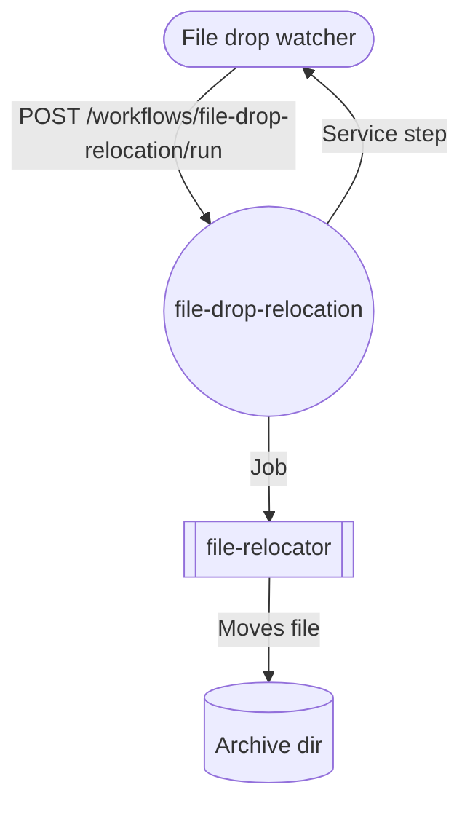

# File Drop Watcher Scenario

The file drop watcher showcases how an external service can orchestrate AppHub workflows. It watches a filesystem directory for new files, launches the `file-drop-relocation` workflow to move each drop into an archive, and surfaces live progress through a minimal dashboard.

## Components

| Component | Description |
| --- | --- |
| `services/examples/file-drop-watcher` | Fastify service that watches the configured directory using `chokidar`, triggers the workflow, and serves `/api/stats` + a dashboard UI. |
| `job-bundles/file-relocator` | Example job bundle that moves a single file to the archival directory while emitting a JSON summary. |
| `file-drop-relocation` workflow | Orchestrates the relocation job and calls back into the watcher service when the job completes. |
| `services/catalog/data/examples/file-drop` | Sample inbox/archive directory tree for local demos. |

## Running the Demo

1. Start the core services (`npm run dev` from the repository root).
2. Install dependencies for the watcher service and start it:

   ```bash
   cd services/examples/file-drop-watcher
   npm install
   FILE_WATCH_ROOT=$(pwd)/../../catalog/data/examples/file-drop/inbox \
   FILE_ARCHIVE_DIR=$(pwd)/../../catalog/data/examples/file-drop/archive \
   CATALOG_API_TOKEN=dev-ops-token \
   npm run dev
   ```

   The dashboard becomes available at <http://127.0.0.1:4310/>. Adjust `CATALOG_API_BASE_URL` if your catalog API listens elsewhere.

3. Import the example job and workflow via the frontend importer (activate the **File drop relocation** example scenario). This uploads the `file-relocator@0.1.0` bundle and registers the workflow.
4. Drop a file into `services/catalog/data/examples/file-drop/inbox`. Within a couple of seconds the watcher enqueues the workflow run, relocates the file into `archive/`, and the dashboard updates the recent activity table.

## Workflow Definition Summary



- **Step 1** (`relocate` job): Executes the `file-relocator` bundle with parameters supplied by the watcher (source path, archive root, drop ID).
- **Step 2** (`notify` service): Calls `POST /api/drops/:dropId/complete` on the watcher, passing the relocation summary so the dashboard can update metrics.

## Environment Variables

| Variable | Default | Purpose |
| --- | --- | --- |
| `FILE_WATCH_ROOT` | `services/catalog/data/examples/file-drop/inbox` | Directory to monitor for new files. |
| `FILE_ARCHIVE_DIR` | `services/catalog/data/examples/file-drop/archive` | Root directory for relocated files. |
| `FILE_DROP_WORKFLOW_SLUG` | `file-drop-relocation` | Workflow triggered when a new file arrives. |
| `CATALOG_API_BASE_URL` | `http://127.0.0.1:4000` | Catalog API origin used to trigger runs. |
| `CATALOG_API_TOKEN` | _required_ | Operator token with `workflows:run` scope. |
| `FILE_WATCH_RESUME_EXISTING` | `true` | When enabled, queue files that already exist in the watch directory on startup. |
| `FILE_WATCH_DEBOUNCE_MS` | `750` | Stabilisation window for filesystem events. |
| `FILE_WATCH_MAX_ATTEMPTS` | `3` | Retry attempts when launching the workflow fails. |
| `PORT` / `HOST` | `4310` / `0.0.0.0` | Network binding for the watcher service. |

## Extending the Scenario

- Add a second workflow step that post-processes relocated files (e.g., extracting archives) and extend the watcher callback payload to show downstream metrics.
- Toggle the watcher retry parameters to simulate transient API outages and observe how the dashboard tracks retries.
- Wire the watcher into a cloud storage bucket (via `aws-sdk` or `gcsfs`) instead of a local directory for more realistic ingest pipelines.
