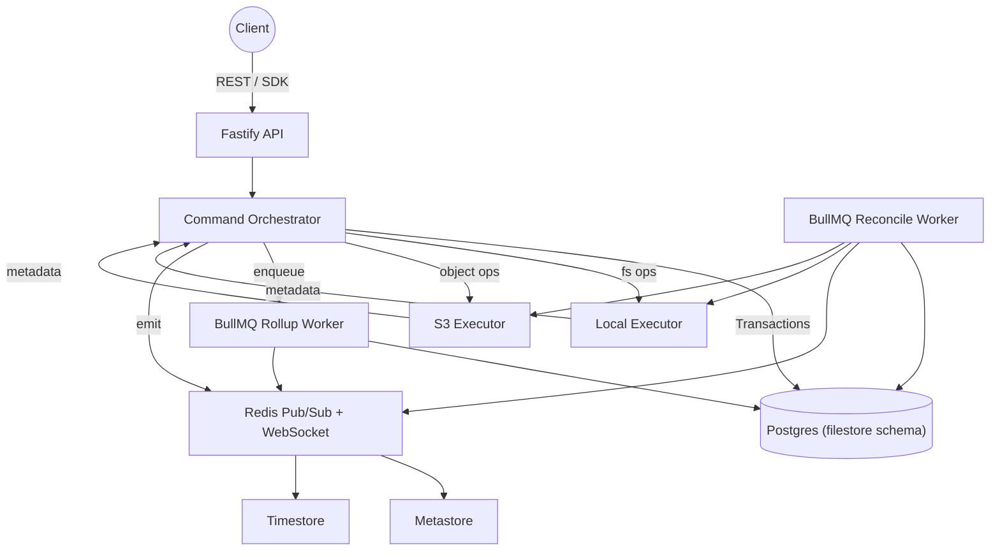
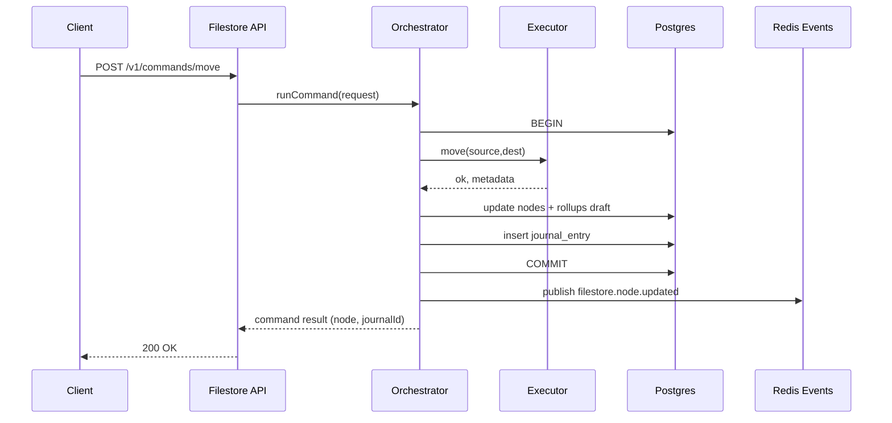
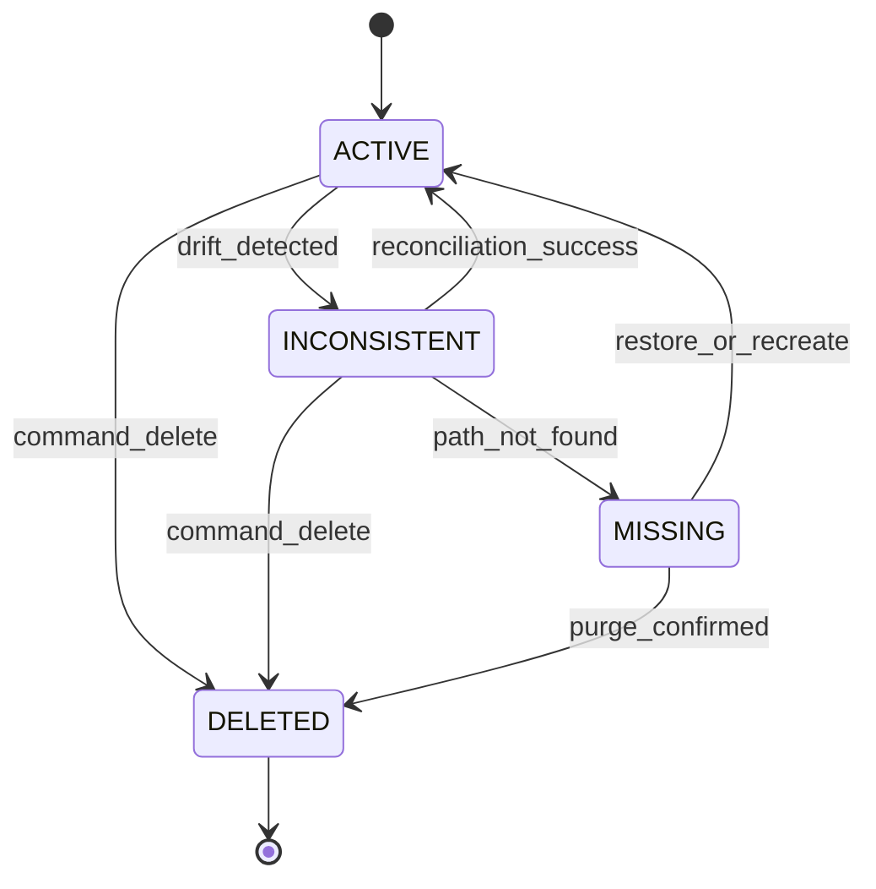

# Filestore Service

The filestore service centralises knowledge about files and directories stored on local volumes and S3 buckets. It exposes transactional APIs for filesystem mutations, maintains canonical metadata in PostgreSQL, and relays change events over Redis so Metastore and Timestore stay consistent without relying on ad-hoc shell scripts or Kafka.

## Objectives
- Provide a single API for reading, writing, moving, copying, and deleting filesystem objects while recording every mutation in a durable journal.
- Keep directory rollups (size, item counts) accurate by updating aggregates inline and reconciling large trees asynchronously via BullMQ workers.
- Detect and heal drift introduced by out-of-band changes using chokidar-based watchers for local mounts and list-based audits for S3 prefixes.
- Publish rich change events through Redis pub/sub and WebSocket bridges so downstream services (Metastore, Timestore, frontend) react in near real time.
- Share the existing platform infrastructure: Fastify conventions, the shared Postgres cluster, BullMQ queues, Redis caches, and the operator auth model.

## Responsibilities
- Own canonical metadata for tracked files and directories, including hashes, checksums, timestamps, backend bindings, and lifecycle state.
- Enforce the rule that clients never mutate tracked trees directly—operations must go through Filestore so the journal, snapshots, and rollups stay accurate.
- Coordinate filesystem executors (local disk, S3) that perform the physical IO work and report back success/failure details to the orchestrator.
- Surface APIs that let callers browse nodes, inspect change history, query directory contents, and request bulk operations.
- Feed Metastore with node identifiers so business metadata (tags, ownership) can attach cleanly, and pipe command history into Timestore for analytics.

## Component Architecture



### API Gateway
- Fastify service under `services/filestore` following catalog/metastore conventions.
- Implements REST endpoints for node inspection, directory listing, snapshots, and mutation commands.
- Handles auth, validation (zod schemas), idempotency headers, and streaming uploads/downloads.

### Command Orchestrator
- Core module that validates commands, loads node context, and wraps executor calls in a Postgres transaction.
- Persists mutations into `nodes`, `snapshots`, and `journal_entries`, increments optimistic version numbers, and records idempotency keys.
- Schedules follow-up work (rollup recomputation, checksum verification) on BullMQ queues and publishes Redis events after commit.

### Executors
- **LocalExecutor**: Performs safe file and directory operations on mounted paths. Uses staging directories + `fs.rename` for atomic writes, preserves POSIX metadata, and emits drift signals when watchers detect external changes.
- **S3Executor**: Wraps `@aws-sdk/client-s3` to list/stat/put/move/delete objects, leveraging multipart uploads for large files and verifying ETag/hash before commit. Retries with exponential backoff to account for eventual consistency.

### Persistence Layer
- Dedicated `filestore` schema in the shared Postgres cluster housing core tables:
  - `backend_mounts`: configured roots (local path, S3 bucket/prefix, credentials hints, access policies).
  - `nodes`: canonical record per file/directory with parent pointer, backend ID, relative path, type, size, checksum/hash, state (`ACTIVE`, `INCONSISTENT`, `MISSING`, `DELETED`), optimistic version, timestamps.
  - `snapshots`: immutable snapshots keyed by node + version for auditing and temporal queries.
  - `journal_entries`: append-only log of commands, executor results, idempotency keys, error context, and correlation IDs.
  - `rollups`: aggregated directory metrics (`size_bytes`, `file_count`, `dir_count`, `last_calculated_at`, `consistency_state`).
  - Supporting indexes (btree on paths/backends, GIN on tags/metadata columns as needed) keep lookups efficient.

### Workers & Watchers
- **Rollup workers** recalculate directory aggregates using BullMQ queues (`filestore_rollup_queue`). Small trees update inline; large trees queue background jobs and publish completion events.
- **Reconciliation workers** consume drift jobs (`filestore_reconcile_queue`) emitted by watchers or scheduled audits, re-stat nodes, sync metadata, mark missing nodes, and emit `filestore.node.reconciled` or `filestore.node.missing` events.
- **Watchers**: per-mount adapters (chokidar for local, S3 notification/listing) detect out-of-band changes, tag nodes as `INCONSISTENT`, and enqueue reconciliation work.

### Event Pipeline
- Redis pub/sub channel (default `apphub:filestore`) broadcasts events like `filestore.node.created`, `filestore.node.updated`, `filestore.node.deleted`, `filestore.command.completed`, and `filestore.drift.detected`.
- Catalog’s existing WebSocket relay can be extended to proxy these events to the frontend without introducing Kafka.
- Consumers (Metastore, Timestore, CLI) subscribe via the shared event bus and can fall back to inline dispatch when `FILESTORE_EVENTS_MODE=inline` or `REDIS_URL=inline`.

## Command Flow



## Node State Lifecycle



## Integrations
- **Metastore** subscribes to node events and stores tags, owners, and business metadata keyed by `node_id`. Mutations propagate using Redis pub/sub so clients always see aligned metadata.
- **Timestore** ingests command journal entries into a `filestore_activity` dataset, enabling time-based analysis (growth, churn, reconciliation lag). Events include deltas to support rollup queries without scanning the entire journal.
- **Catalog / Frontend** consume WebSocket events to refresh dashboards and surface storage metrics alongside app/build metadata.

## Security & Auth
- Reuse existing bearer token model with scopes like `filestore:read`, `filestore:write`, `filestore:admin` plus optional namespace/path allow lists.
- Sensitive operations (move, delete, S3 credential updates) require elevated scopes. Tokens can be rotated via shared operator tooling.
- Journal entries capture acting principal, idempotency key, request ID, and executed backend for auditing.

## Observability
- Prometheus metrics exported via `/metrics`: command latency histograms, executor success/failure counters, bytes processed, rollup queue depth, reconciliation backlog, watcher drift events.
- Structured logs include journal IDs for traceability. Optional OpenTelemetry spans integrate with the platform tracing configuration.
- Health endpoints (`/health`, `/ready`) verify Postgres connectivity, Redis availability (except inline mode), and recent migration state.

## Local Development
```bash
npm install
npm run dev --workspace @apphub/filestore
```

- Defaults to inline Redis mode (`REDIS_URL=inline`) so BullMQ queues execute synchronously.
- Postgres connection points to the shared development database; migrations run automatically on boot.
- Mount configuration pulled from `FILESTORE_BACKENDS_PATH` (JSON or YAML) describing local directories and mock S3 buckets (e.g., MinIO).
- Watchers and reconciliation workers can be launched via `npm run dev:filestore:watchers` and `npm run dev:filestore:workers` to simulate drift handling end-to-end.

## Rollout Phases
1. **Observe-only**: register mounts, run watchers, and log drift without blocking manual changes. Validate metadata accuracy and event payloads.
2. **Enforced mutations**: route catalog/build pipelines through the Filestore SDK so mutations go through the API. Enable rollup updates and reconciliation alarms.
3. **Metadata convergence**: hook Metastore/Timestore consumers to the event feed so tags and timelines align with journal output.
4. **Operationalisation**: finalise SLOs (availability, command success, reconciliation lag), configure alerts, and document runbooks.

## Open Questions & Risks
- **Path policy enforcement**: Do we need hierarchical ACLs per namespace, or is backend-level scoping sufficient? (Owner: Platform Auth)
- **Large directory operations**: For trees with millions of nodes, do we batch commands or invent streaming protocols? Evaluate BullMQ job splitting strategy.
- **S3 consistency windows**: How do we expose eventual consistency delays to callers? Consider returning `pendingVerification=true` when manifest confirmation is queued.
- **Disaster recovery**: Should journal entries stream to object storage for replay if Postgres experiences data loss? Investigate logical replication or WAL archiving alignment.
- **CLI ergonomics**: Determine how much functionality belongs in the initial CLI vs. future enhancements (e.g., diffing, dry-run mode).

Document owners: Platform infrastructure team. Reviews required: reliability, security, ingestion owners.
